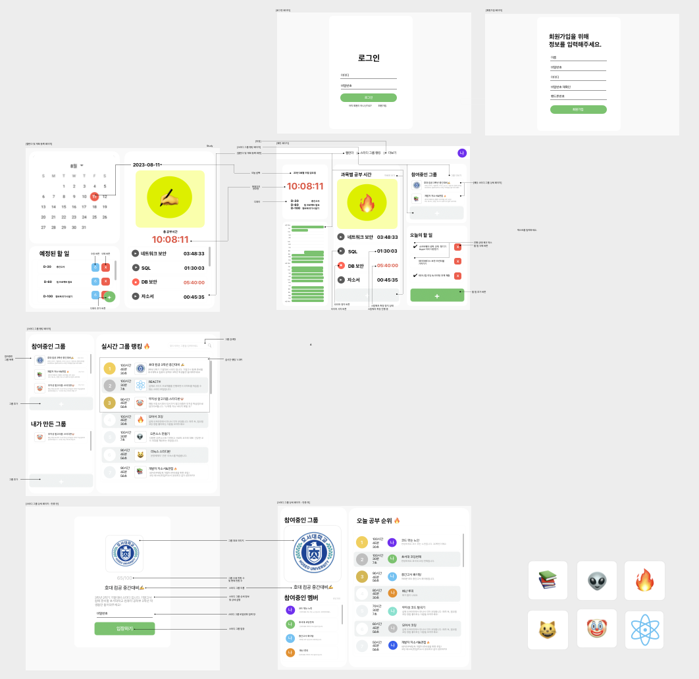
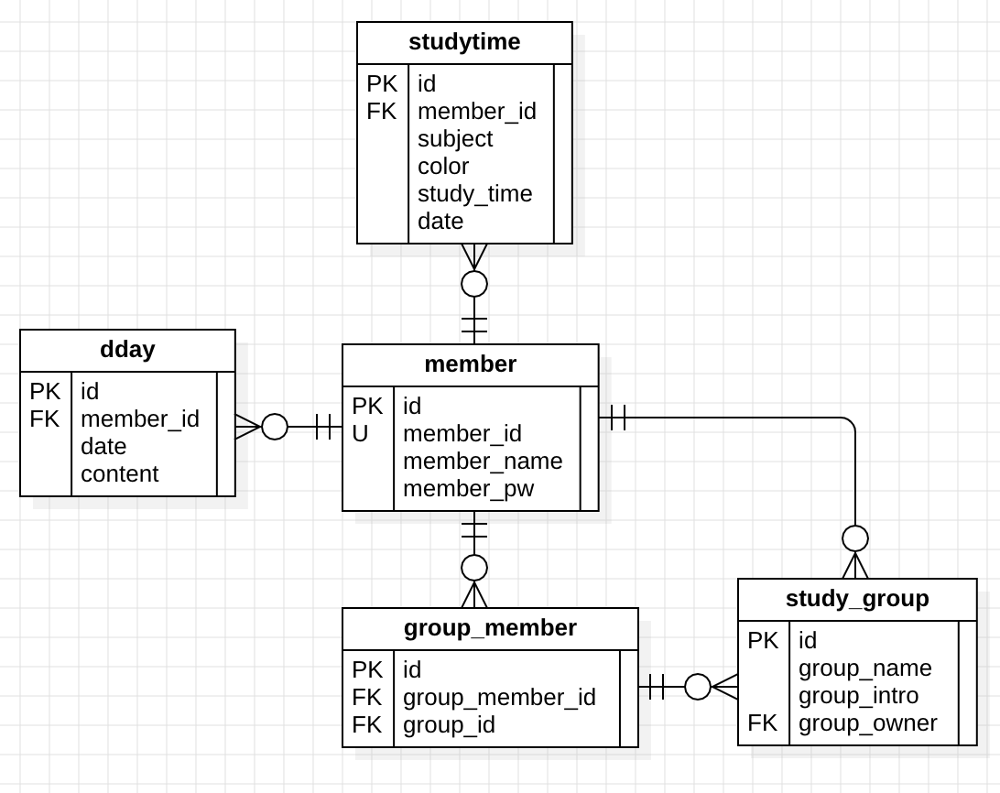
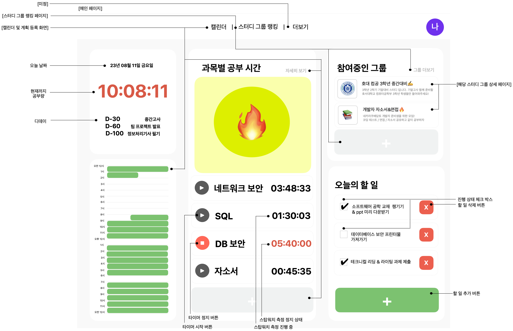
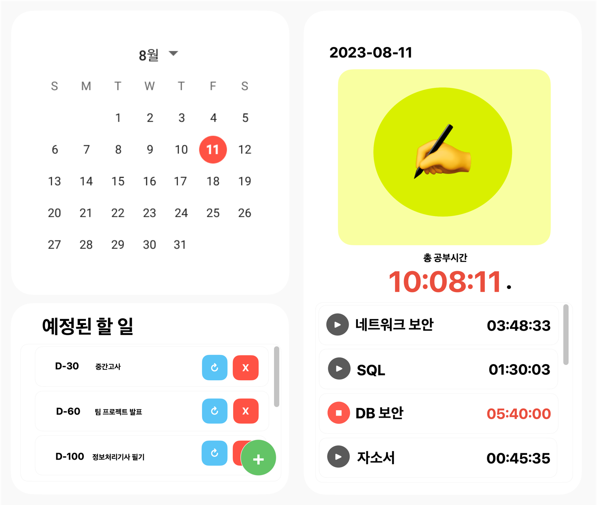
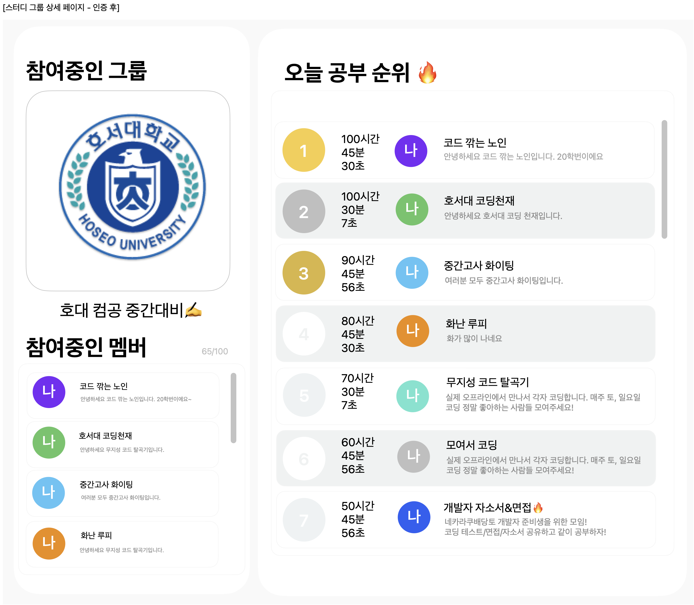

# Gachigong

```
“공부에 가치를 더하다”, “같이 공부하다.” 라는 중의적인 뜻을 담고있는 웹 어플리케이션으로
2023년 11월 22일 개발을 시작해 12월 4일 개발을 완료한 스프링부트 프레임워크를 사용한
팀 프로젝트입니다.
```

## 디자인 시안


## 데이터 모델 다이어그램 (ERD)


## 개발 환경
- JAVA 17 (openjdk 17.0.8.1)
- MySQL 8.1.0
- MacOS Ventura 13.5
- IntelliJ IDEA 2023.2.4 (Community Edition)

## 기술 스택
- Spring Boot 3.1.5
- JPA 3.1.5
- mustache 3.1.5
- Lombok 1.18.30
- Gradle 8.4

## 세부 페이지 설명
(1) `메인 페이지` (홈 화면), (2) `캘린더 및 계획 등록 페이지`, (3) `스터디 그룹 랭킹 페이지`, (4) `스터디 그룹 상세 페이지` (5) `로그인 및 회원가입 페이지`로 구성되어 있습니다.
### 메인 페이지 ( 홈 화면 )


### 캘린더 및 계획 등록 페이지


### 스터디 그룹 랭킹 페이지


### 스터디 그룹 상세 페이지
