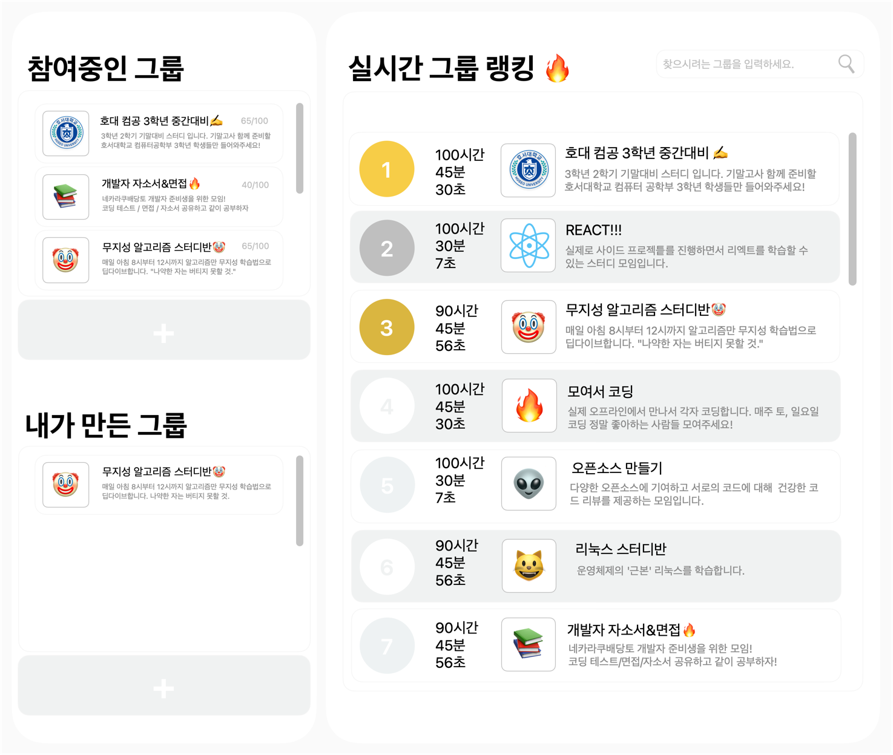

# Gachigong
```
“공부에 가치를 더하다”, “같이 공부하다.” 라는 중의적인 뜻을 담고있는 웹 어플리케이션으로
2023년 11월 22일 개발을 시작해 12월 4일 개발을 완료한 스프링부트 프레임워크를 사용한
팀 프로젝트입니다.
```


## 디자인 시안 (와이어 프레임)


## 데이터 모델 다이어그램 (ERD)


## 개발 환경
- JAVA 17 (openjdk 17.0.8.1)
- MySQL 8.1.0
- MacOS Ventura 13.5
- IntelliJ IDEA 2023.2.4 (Community Edition)

## 기술 스택
- Spring Boot 3.1.5
- JPA 3.1.5
- mustache 3.1.5
- Lombok 1.18.30
- Gradle 8.4

## 상세 페이지 설명
가치공 프로젝트는 (1) `메인 페이지` (홈 화면), (2) `캘린더 및 계획 등록 페이지`, (3) `스터디 그룹 랭킹 페이지`, (4) `스터디 그룹 상세 페이지` (5) `로그인 및 회원가입 페이지` 총 5개의 페이지로 구성되어 있습니다.

### (1) 메인 페이지 ( 홈 화면 )


* `실시간 공부 총 합계` : 과목별 공부 시간을 모두 합산한 시간을 보여줍니다.
* `시간별 실시간 공부 현황` : 시간대 별로 공부 시간을 시각화하여 보여줍니다. 
* `과목별 공부 시간` : 카테고리 별 공부 시간을 보여줍니다.
* `참여중인 그룹` : 내가 방장으로 있는 스터디 그룹과 그룹원으로 가입된 스터디 그룹의 현황을 보여주는 대쉬보드
* `오늘의 할 일` : 오늘에 국한된 할 일의 현황을 보여주는 대쉬보드

### (2) 캘린더 및 계획 등록 페이지


* `캘린더` : 캘린더를 보여주며 디폴드 값으로 오늘 날짜가 설정되어 있습니다.
* `예정된 할 일` : 캘린더와 연동 되어있으며 사용자가 캘린더의 특정 날짜를 클릭하면 해당 날짜의 예정된 할 일을 조회하여 보여줍니다. 캘린더와 마찬가지로 디폴트 값은 현재 날짜입니다.
* `과목별 공부 시간` : 카테고리 별 공부 시간을 보여줍니다.

### (3) 스터디 그룹 랭킹 페이지


* `참여중인 그룹` : 내가 만든 그룹 (내가 방장으로 있는 그룹)을 포함해서 내가 가입되어있는 그룹 전체를 보여줍니다.
* `내가 만든 그룹` : 내가 방장으로 있는 그룹의 현황을 보여줍니다.
* `실시간 그룹 랭킹` : 전체 그룹의 실시간 그룹 랭킹을 보여줍니다.

### (4) 스터디 그룹 상세 페이지


### (5) 로그인 및 회원가입 페이지

## 개발 일정
|     | 개발 일정   | 버전 |
|-----|---------|----|
|1차 개발 및 배포|2023.11.22 ~ 2023.12.4| v1.0|
|2차 개발 및 배포|||

